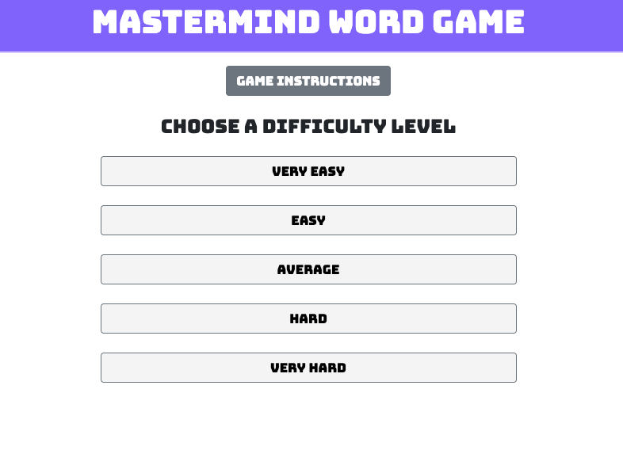

<h1>MasterMind Word Guessing Application</h1>

A Word guessing game built a React/Redux in a two person team. 
* Worked on retrieving guess words from a JSON
* Created the logic that sets the difficulty level 
* Developed the portion where the app changes from the difficulty settings view to the word game view
* Designed the color display and responsive button size 

The Heroku Link is below: 
[https://amy-leah-webdev-spr-a2.herokuapp.com/]

*Code will not be posted until the class is over (Currently being graded)*
 
